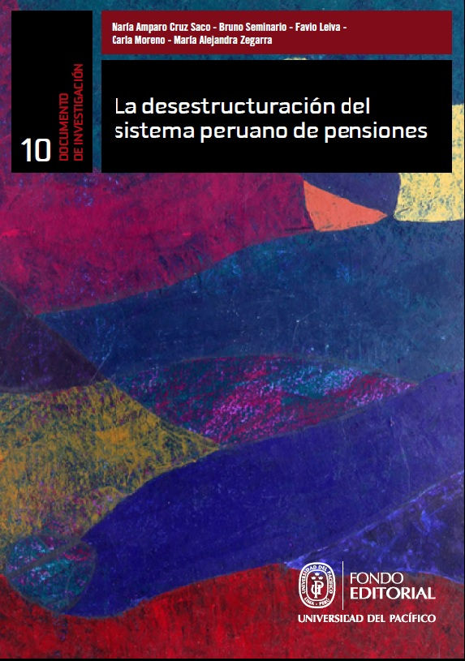

# Publications

## Leiva, F. (2023)
**Más de 100 años de historia comercial entre Perú y Japón.** *Política Internacional*, 134, 240–262. [Read more](https://revista.adp.edu.pe/index.php/RPI/article/view/103)

---

## Cruz Saco, M. A., Gil, M., and Leiva, F. (2021)
**Transition and the Middle-Income Trap in Peru: A Long Term Perspective since the Late 19th Century.** In R. Santa Gadea and Y. Zhang (Eds.), *Finding a Way to Avoid the Middle Income Trap: The Cases of China and Peru* (pp. 78–116). China Social Sciences Press. [Read more](https://bit.ly/3GWDeSz)

---

## Alarco, G., Castillo, C., and Leiva, F. (2019)
**Riqueza y Desigualdad en el Perú: Visión Panorámica.** OXFAM. [Read more](https://bit.ly/3J5fYDJ)

---

## Alarco, G., Castillo, C., and Leiva, F. (2019)
**Desigualdad factorial, personal y de la riqueza en Perú, 1950-2016.** *Problemas Del Desarrollo. Revista Latinoamericana de Economía*, 50(197), 31–58. [Read more](https://bit.ly/32gbmK6)

---

## Cruz-Saco, M. A., Seminario, B., Leiva, F., Moreno, C., and Zegarra, M. A. (2018)
**El porvenir de la vejez: demografía, empleo y ahorro.** Fondo Editorial de la Universidad del Pacífico. [Read more](https://bit.ly/3pl0V17)

---

## Cruz-Saco, M. A., Seminario, B., Leiva, F., Moreno, C., and Zegarra, M. A. (2018)
**La desestructuración del sistema peruano de pensiones (No. 10; Documentos de Investigación).** [Read more](https://bit.ly/3stgghI)

